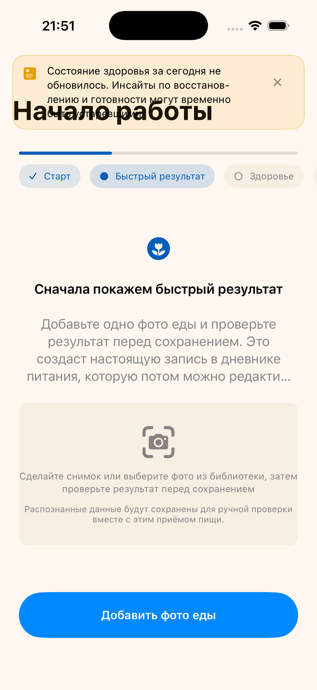
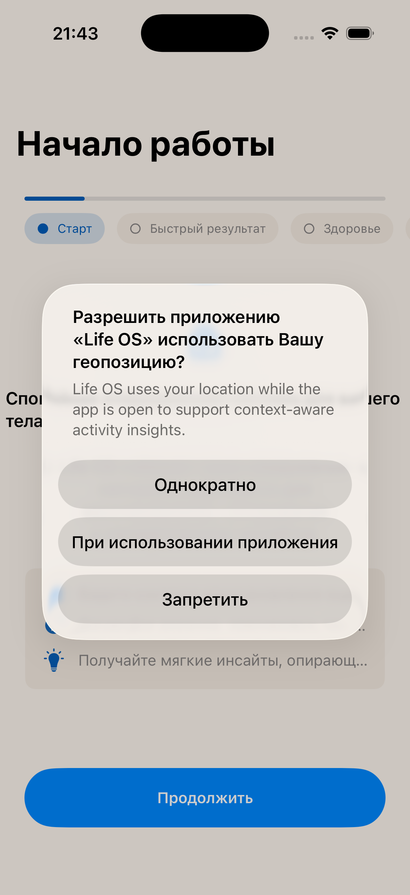

# Первый запуск Life OS без тестовых подстановок

Проверено 12 сентября 2026 на чистом iPhone 17 Pro Simulator, iOS 26.5, Debug-сборка текущего рабочего дерева. Язык `ru`, locale `ru_RU`. Установлено обычное приложение; `UITestBootstrap`, seeded data и отключение background work не использовались. У сборки нет настоящей production-конфигурации Supabase; это проверка local fallback, а не hosted deployment.

Вручную осмотрен первый экран, отклонён запрос геопозиции, нажато «Продолжить», осмотрен второй шаг. Дальнейший интерактивный проход photo picker/отмены не выполнен: Mac заблокировался, CUA больше не получал доступ к UI. Поведение переходов и отмены ниже отдельно проверено по исходникам. Это ограничение среды, не дефект приложения.

## CR-U01 / P1 — обязательное фото блокирует вход для пользователя без фотографии

**Наблюдение:** после «Продолжить» виден шаг «Быстрый результат», 33% прогресса и единственная кнопка «Добавить фото еды». Нет пропуска, ручной альтернативы или перехода к другим модулям. Пользователь, которому нужен сон/тренировки, всё равно обязан сделать фото и сохранить запись еды.

**Цепочка исходников:**

- `ios/LifeOS/Modules/Auth/OnboardingView.swift:200–301`: у незавершённого quick win только действие capture. Chips прогресса не являются навигацией.
- `OnboardingView.swift:106–125`: `.completeQuickWin` вызывается после завершения `NutritionLogView` review/save.
- `ios/LifeOS/Modules/Nutrition/NutritionCaptureViews.swift:16–121`: до выбора изображения доступны камера, библиотека и отмена. Кнопки использования/сохранения для последующей обработки появляются только при наличии изображения.
- `NutritionCaptureViews.swift:180–213`: «сохранить на потом» и отмена закрывают capture, не завершают onboarding milestone. В onboarding не передан обработчик, который делал бы такой переход.
- `ios/LifeOS/Modules/Auth/OnboardingFeature.swift:346–350`: переход к следующему шагу отклоняется, пока `quickWinCompleted=false`.

**Почему тест проходит:** `OnboardingView.swift:1494–1501` при `UITestBootstrap.isEnabled` сразу отправляет `.completeQuickWin`. `ios/LifeOSUITests/EndToEndScenariosUITests.swift:85–92` использует именно этот обход. Поэтому зелёный onboarding test не проверяет реальный capture → review → save → continue, отмену и отсутствие фото.

**Последствие:** пользователь без подходящей фотографии не может начать вести другие журналы. Даже успешное распознавание нельзя считать доказанным по текущему E2E. Фото работает с local fallback, поэтому здесь не утверждается, что для входа обязательно нужен платный AI или cloud.

**Исправление:** добавить явное «Пропустить» с сохранением корректного milestone либо необязательный демонстрационный пример, не засоряющий личную историю. Проверить установку с нуля без фото, отмену picker и повторный запуск. Для реального photo-сценария убрать обход из отдельного acceptance test.

**Доказательство:** обычный UI для отсутствия доступного пропуска + прямой разбор reducer/capture для поведения отмены. Полный capture в этом ручном проходе не выполнен.

## CR-U02 / P2 — первый экран сразу запрашивает геопозицию с английским пояснением

Запрос появляется до нажатия первой кнопки онбординга. Системные кнопки русские, а объяснение приложения — на английском. Строка задана в `ios/LifeOS/App/Info.plist:45–46`; запрос выполняет `ios/LifeOS/Modules/Shared/Services/EnvironmentService.swift:157–187`.

Это UX/локализационная проблема: контекст запроса пользователю ещё не объяснён. Аудит не устанавливал получение координат без разрешения. После «Запретить» переход ко второму шагу сработал.

Исправление: локализовать purpose string и запрашивать разрешение при включении соответствующей функции с объяснением пользы.

## CR-U03 / P2 — баннер перекрывает заголовок; описания обрезаются

В fresh local fallback появляется предупреждение «Состояние здоровья за сегодня не обновилось…» до подключения HealthKit. На втором скриншоте его текст физически перекрывается крупным заголовком «Начало работы». Описание quick win заканчивается «редакти…», хотя места и объяснения для прохождения шага недостаточно; тексты преимуществ на первом экране также обрезаются.

Воспроизведено при русском языке на iPhone 17 Pro Simulator без включения accessibility text size. Основание — непосредственное визуальное наблюдение. Первопричина всего banner layout отдельно не изолировалась.

Исправление: учитывать высоту баннера в layout/safe area, не показывать предупреждения о не настроенном источнике как о сбое синхронизации, разрешить многострочное описание/вертикальную прокрутку. Добавить проверку первого запуска на русском с обычной background work.
