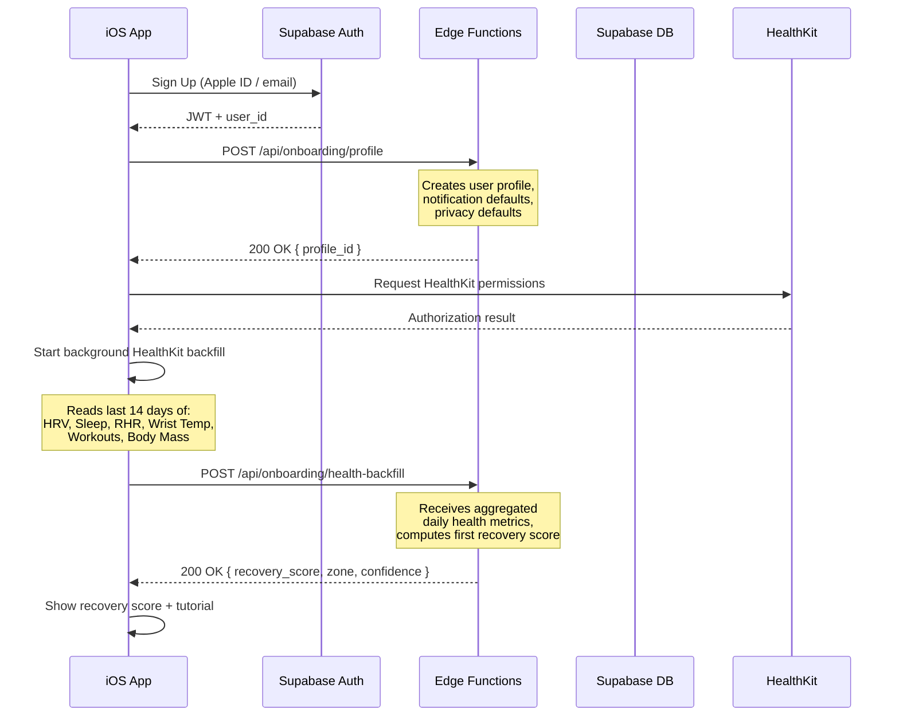

# LIFE OS — ONBOARDING BACKEND SPECIFICATION

**Version:** 0.1  
**Date:** February 16, 2026  
**Purpose:** Server-side specification for user onboarding flow: account creation, profile setup, HealthKit initial backfill orchestration, and first recovery score computation.

> [!IMPORTANT]
> Onboarding is the **highest-churn moment** in the user journey.  
> Every backend operation must be fast (< 2s per step), resilient (offline-capable where possible), and progressive (user can start using the app before all data is ready).

---

## 0) Non-Negotiables

1. **Onboarding must work offline** for profile creation. Account creation requires network, but the user can explore the app with a local-only profile and sync later.
2. **No blocking on HealthKit backfill.** HealthKit data import happens in the background. The user sees a "Calculating your first recovery score..." placeholder and can start logging food immediately.
3. **First recovery score within 60 seconds** of HealthKit permission grant (if data is available).
4. **Progressive disclosure.** Don't ask for everything upfront. Collect essentials (age, sex, weight, height) and defer optional fields (supplements, goals, training history) to later.

---

## 1) Onboarding Flow (Backend Perspective)



---

## 2) API Endpoints

### 2.1 POST /api/onboarding/profile

Creates the user profile and default settings in a single transaction.

**Request:**
```json
{
  "display_name": "string (optional)",
  "age_range": "25_34",
  "date_of_birth": "YYYY-MM-DD (optional, privacy-sensitive — only stored if user provides it)",
  "sex": "male | female | prefer_not_to_say",
  "height_cm": 175,
  "weight_kg": 72.0,
  "timezone": "Asia/Bangkok",
  "utc_offset_minutes": 420,
  "locale": "ru-RU",
  "health_flags": {
    "has_cardiac_condition": false,
    "has_pacemaker": false,
    "is_pregnant": false,
    "has_eating_disorder_history": false
  },
  "analytics_consent": true,
  "vector_search_consent": false
}
```

**Server behavior (single transaction):**
1. `INSERT INTO users` — core profile.
2. `INSERT INTO user_health_flags` — health safety flags.
3. `INSERT INTO notification_settings ON CONFLICT (user_id) DO NOTHING` — defaults (morning_brief=true, quiet_hours 22:00–07:00, control_level=advisory, ≤6/day cap). Uses `ON CONFLICT` to avoid duplicates if the user already created settings locally while offline.
4. `INSERT INTO privacy_settings` — defaults (menstrual_local_only=true, medical_scan_local_only=true, vector_opt_in=per request body).
5. `INSERT INTO onboarding_state` — `{ step: "profile_complete", completed_at: now() }`.

**Response:**
```json
{
  "profile_id": "uuid",
  "defaults_applied": {
    "notification_cap": 6,
    "quiet_hours": "22:00-07:00",
    "control_level": "advisory",
    "morning_brief": true
  }
}
```

**Error handling:**
- If profile already exists for this `user_id`: return `409 Conflict` with existing profile.
- If required fields missing: return `422 Unprocessable Entity` with field-level errors.

### 2.2 POST /api/onboarding/health-backfill

Receives the client's initial HealthKit data dump and computes the first recovery score.

**Request:**
```json
{
  "backfill_days": 14,
  "daily_metrics": [
    {
      "date": "2026-02-15",
      "timezone": "Asia/Bangkok",
      "utc_offset_minutes": 420,
      "hrv_sdnn_ms": 62.5,
      "hrv_source": "apple_watch",
      "hrv_sample_count": 12,
      "sleep_duration_hours": 7.33,
      "sleep_start_utc": "2026-02-14T23:00:00Z",
      "sleep_end_utc": "2026-02-15T06:20:00Z",
      "deep_sleep_hours": 1.4,
      "rem_sleep_hours": 1.8,
      "resting_heart_rate_bpm": 58,
      "rhr_source": "apple_watch",
      "wrist_temperature_deviation_c": 0.1,
      "active_energy_kcal": 420,
      "workout_sessions": [
        {
          "type": "running",
          "duration_min": 35,
          "calories_kcal": 320,
          "avg_heart_rate": 155
        }
      ],
      "body_mass_kg": 72.1,
      "body_fat_percentage": null
    }
  ]
}
```

**Server behavior:**
1. Validate and deduplicate against existing `physiological_states` (idempotent by `user_id + date`).
2. Bulk insert `physiological_states` rows.
3. Compute baselines:
   - `hrv_baseline` = 7-day rolling mean of ln(HRV) with IQR outlier removal (per `life_os_recovery_algorithms.md` §1 `calculateHRVBaseline`).
   - `rhr_baseline` = 7-day rolling mean of RHR values.
   - `sleep_baseline` = rolling 14-day average of sleep duration.
4. Compute first recovery score for today (per `life_os_recovery_algorithms.md` §1–§5).
5. Store baselines in `user_baselines` table.
6. Return recovery score + confidence.

**Response:**
```json
{
  "recovery_score": 78,
  "recovery_zone": "optimal",
  "confidence": 0.72,
  "confidence_note": "Based on 18 days of data. Score accuracy will improve over the next 2 weeks.",
  "baselines_computed": {
    "hrv_ln_sdnn_baseline": 3.86,
    "rhr_baseline": 59,
    "sleep_baseline_hours": 7.1
  },
  "days_processed": 18,
  "days_with_full_data": 12
}
```

**Confidence logic:**
- < 7 days of data: confidence ≤ 0.50, note "Very early — accuracy will improve significantly"
- 7–14 days: confidence 0.50–0.65, note "Building your baseline"
- 14–21 days: confidence 0.65–0.80, note "Baseline stabilizing"
- ≥ 21 days: confidence ≥ 0.80, note "Baseline established"

**Error handling:**
- If no HRV or sleep data in backfill: return recovery_score: null, confidence: 0, note: "No wearable data found. Connect Apple Watch for recovery tracking."
- If partial data (e.g., HRV but no sleep): compute partial score with degraded confidence and note which inputs are missing.

---

## 3) Onboarding State Machine

```swift
enum OnboardingStep: String, Codable {
    case not_started
    case auth_complete           // User signed up
    case profile_complete        // Profile saved
    case healthkit_prompted      // HealthKit permission shown
    case healthkit_granted       // Permission granted (full or partial)
    case healthkit_skipped       // User skipped HealthKit
    case backfill_in_progress    // HealthKit data being imported
    case backfill_complete       // First recovery score computed
    case tutorial_shown          // Recovery score tutorial shown
    case onboarding_complete     // User reached Home screen
}
```

**State stored in:** `onboarding_state` table (server) + local `UserDefaults` (client).  
**Resume logic:** If app is killed during onboarding, resume from last completed step on next launch.

---

## 4) Offline Onboarding Fallback

If the user has no network during onboarding:

1. **Profile creation:** Store locally in GRDB. Enqueue as outbox event. User can start using app immediately.
2. **HealthKit backfill:** Happens entirely on-device. Recovery score computed locally using same algorithms.
3. **Account creation:** Deferred. Show a subtle "Sign in to sync your data" banner. App is fully functional without account.
4. **Sync on reconnection:** When network returns, create account → sync profile → sync backfill data → merge with any server-side state.

---

## 5) Rate Limiting

| Endpoint | Limit | Notes |
|----------|-------|-------|
| `POST /api/onboarding/profile` | 5/min per IP | Prevent account creation spam |
| `POST /api/onboarding/health-backfill` | 2/min per user | Large payload; prevent abuse |

---

## 6) Implementation Checklist

- [ ] Create `onboarding_state` table with RLS (user can only read/write own state).
- [ ] Create `user_baselines` table for HRV/RHR/Sleep baselines.
- [ ] Implement `POST /api/onboarding/profile` Edge Function with transaction.
- [ ] Implement `POST /api/onboarding/health-backfill` Edge Function with baseline computation.
- [ ] Implement client-side HealthKit backfill with progress indicator.
- [ ] Implement offline onboarding fallback (local profile + outbox).
- [ ] Add onboarding analytics events (see `life_os_analytics_catalog.md`).
- [ ] Add E2E tests for onboarding happy path and offline fallback.
- [ ] Add rate limiting to onboarding endpoints.
